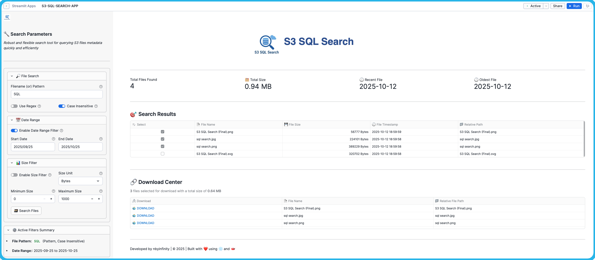

#  S3-SQL-Search: Serverless File Search Engine for AWS S3 with Snowflake and Streamlit

> Transform your AWS S3 storage into a lightning-fast, searchable data lake with SQL superpowers! 🚀

**⭐ If you find this project useful, please consider giving it a star on GitHub! ⭐**

## 📋 Table of Contents
- [📖 Overview](#-overview)
- [🚀 Key Features](#-key-features)
- [📐️ Architecture](#-architecture)
- [📚 Setup Instructions](#-setup-instructions)
- [🤝 Contributing](#-contributing)
- [📄 License](#-license)

## 📖 Overview

AWS S3 provides highly durable and scalable object storage, but searching for files using complex patterns or filtering by date is challenging with its native tools. Traditional approaches often require custom scripts or resource-intensive ETL processes.

**S3-SQL-Search** addresses this gap by integrating **Snowflake** and **AWS** to deliver fast, flexible search capabilities for your S3 file metadata. With this solution, you can perform near real-time searches using SQL, regular expressions, and date filters—all through a secure, intuitive Streamlit web interface.

By leveraging Snowflake Directory Tables and event-driven processing, S3-SQL-Search keeps your metadata index up-to-date automatically and enables efficient, secure access to your S3 files.

## 🚀 Key Features

### 🔍 **Advanced Search Capabilities**
- **Regex Pattern Matching**: Search files using powerful regular expressions for complex naming patterns and advanced filtering
- **SQL LIKE Wildcards**: Use familiar `%` wildcards for simple, fast pattern matching
- **Timestamp-Based Filtering**: Filter files by creation date, modification date, or custom date ranges
- **Multi-Criteria Filtering**: Combine filename patterns, dates, and file sizes in single queries

### ⚡ **Performance & Scalability**
- **Lightning-Fast Queries**: Sub-second search results even across millions of files
- **Query Result Caching**: Snowflake automatically caches results for repeated searches, delivering instant responses when the underlying data hasn't changed
- **Auto-Scaling Architecture**: Handles growing S3 data volumes without performance degradation
- **Event-Driven Updates**: Real-time metadata updates within minutes of S3 changes
- **Cost-Optimized**: Dramatically lowers costs for frequent, complex, and concurrent user searches by replacing expensive S3 `List` API calls with efficient queries on indexed metadata.

### 🔒 **Security & Reliability**
- **Role-Based Access Control (RBAC)**: Application access is managed through Snowflake roles, ensuring only authorized users can use the search interface
- **File-Level Access Control**: Optional row-level security to restrict file access by user or role using configurable access policies
- **Pre-Signed URLs**: Secure file downloads without exposing AWS credentials
- **Audit Trail**: Complete logging of all file searches and user activities via Snowflake query history
- **Enterprise-Grade**: Built on Snowflake and AWS for maximum reliability

### 💻 **User Experience**
- **Intuitive Web Interface**: Easy-to-use Streamlit application with professional design and emoji-enhanced UI
- **Interactive Results**: Real-time search with advanced filters and sortable result tables
- **Real-Time Metrics Dashboard**: Instant visibility into total files found, combined size, and date ranges
- **Organized Filter Panels**: Collapsible sections for file search, date range, and size filters with toggle controls to enable/disable filters
- **Flexible Size Units**: Choose from Bytes, KB, MB, or GB for intuitive file size filtering
- **Secure File Downloads**: Generate time-limited pre-signed URLs (15-minute expiration) for safe file access
- **Professional Design**: Logo integration and responsive interface optimized for all screen sizes

---

## 📐 Architecture

The solution is built on a modern, event-driven data architecture that is scalable and cost-effective.

### 📦 Architecture Components

The architecture consists of seven main components:

1. **AWS S3 Bucket:** The source of your files. This is where your raw data resides.
2. **S3 Event Notifications:** S3 is configured to send event notifications (`object:created`, `object:removed`) to a Snowflake-managed SQS queue whenever a file is added or deleted.
3. **Snowflake External Stage with Directory Table:**
   - An **External Stage** with `DIRECTORY = (ENABLE = TRUE)` creates a **Directory Table** that automatically tracks S3 file metadata.
   - The Directory Table is configured with `AUTO_REFRESH = TRUE` to process SQS notifications in near real-time, ensuring S3 events are captured automatically.
4. **Snowflake Stream:**
   - A **Stream** is created on the Directory Table to capture all new or modified records (change data capture).
   - The stream tracks inserts and deletes, providing a real-time view of metadata changes from S3.
5. **Snowflake Task:**
   - A **Task** runs on a schedule (e.g., every minute) to process the changes from the stream.
   - The task merges the delta records into the final, structured `FILE_METADATA` table, keeping the search index up-to-date.
6. **FILE_METADATA Table:**
   - The final, structured Snowflake table that stores searchable S3 file metadata.
   - Contains file paths, names, sizes, timestamps, ETags, and file URLs.
   - This is the primary table queried by the Streamlit application for all search operations.
7. **Snowflake Streamlit App:** A web application built using Streamlit and hosted within Snowflake. This app provides the user interface for searching the `FILE_METADATA` table.

---

> **⚠️ Important Note on Naming Conventions**
>
> To ensure consistency and simplify the setup process, this solution uses predefined names for all AWS and Snowflake components (e.g., `ROLE_S3_SQL_SEARCH_APP_ADMIN`, `STORAGE_INT_S3_SQL_SEARCH`, etc.). These names are referenced throughout the documentation and scripts.
>
> **⚠️ S3 Bucket Name**: Throughout all setup files, configuration templates, and SQL scripts, replace `your-s3-bucket-name` with your actual S3 bucket name (e.g., `my-company-data-lake`).
>
> You have the flexibility to use your own names for other components. However, if you choose to do so, you must **carefully replace the default names in every relevant file, script, and command**. For a smoother initial setup, we recommend using the default names provided.

Below is a reference table of the default names used throughout this solution's setup guides.

### 📋 Component Naming Reference

| Platform        | Component Type        | Default Name                           | Purpose                                                    |
| :-------------- | :-------------------- | :------------------------------------- | :--------------------------------------------------------- |
| **AWS**         |                       |                                        |                                                            |
| AWS             | S3 Bucket             | `your-s3-bucket-name`                  | Storage location for files to be indexed and searched      |
| AWS             | IAM Role              | `IAM_ROLE_S3_SQL_SEARCH_APP`           | Allows Snowflake to access S3 bucket securely              |
| AWS             | IAM Policy            | `IAM_POLICY_S3_SQL_SEARCH_APP`         | Defines S3 permissions for the IAM role                    |
| AWS             | S3 Event Notification | `EVENT_NOTIFICATION_S3_SQL_SEARCH_APP` | Triggers metadata updates when files change in S3          |
| **Snowflake**   |                       |                                        |                                                            |
| Snowflake       | Database              | `S3_SQL_SEARCH`                        | Main database containing all application objects           |
| Snowflake       | Schema                | `APP_DATA`                             | Schema for tables, stages, streams, tasks, and Streamlit app |
| Snowflake       | Schema                | `APP_DATA_SECURITY`                    | Schema for row access policies and security configurations |
| Snowflake       | Warehouse             | `WH_S3_SQL_SEARCH_XS`                  | Compute resource for query execution (XS size, auto-suspend) |
| Snowflake       | Admin Role            | `ROLE_S3_SQL_SEARCH_APP_ADMIN`         | Full administrative access to all application components   |
| Snowflake       | Developer Role        | `ROLE_S3_SQL_SEARCH_APP_DEVELOPER`     | Create and manage application objects                      |
| Snowflake       | Viewer Role           | `ROLE_S3_SQL_SEARCH_APP_VIEWER`        | Read-only access for querying data via Streamlit app       |
| Snowflake       | App Role 1            | `ROLE_S3_SQL_SEARCH_APP_ROLE_1`        | Demonstrates row-level security with restricted user access pattern |
| Snowflake       | App Role 2            | `ROLE_S3_SQL_SEARCH_APP_ROLE_2`        | Demonstrates row-level security with restricted role access pattern |
| Snowflake       | Admin User            | `USER_S3_SQL_SEARCH_APP_ADMIN`         | User assigned to admin role for system management          |
| Snowflake       | Developer User        | `USER_S3_SQL_SEARCH_APP_DEVELOPER`     | User assigned to developer role for app development        |
| Snowflake       | Viewer User           | `USER_S3_SQL_SEARCH_APP_VIEWER`        | User assigned to viewer role for read-only app access      |
| Snowflake       | App User 1            | `USER_S3_SQL_SEARCH_APP_USER_1`        | User for demonstrating row-level security user scenario       |
| Snowflake       | App User 2            | `USER_S3_SQL_SEARCH_APP_USER_2`        | User for demonstrating row-level security role scenario       |
| Snowflake       | Storage Integration   | `STORAGE_INT_S3_SQL_SEARCH`            | Connects Snowflake to S3 with delegated authentication     |
| Snowflake       | External Stage        | `EXT_STAGE_S3_SQL_SEARCH`              | External stage with directory table for S3 file tracking   |
| Snowflake       | Stream                | `STREAM_S3_SQL_SEARCH`                 | Captures change data from directory table for processing   |
| Snowflake       | Task                  | `TASK_S3_SQL_SEARCH`                   | Automated task to merge file metadata changes              |
| Snowflake       | Table                 | `FILE_METADATA`                        | Final table storing searchable S3 file metadata            |
| Snowflake       | Row Access Policy     | `ROW_ACCESS_POLICY_S3_SQL_SEARCH_APP`  | Controls file-level access based on user/role rules (optional) |
| Snowflake       | Mapping Table         | `ROW_ACCESS_POLICY_MAPPING_S3_SQL_SEARCH_APP` | Stores dynamic access rules for mapping table approach (optional) |
| Snowflake       | Named Stage           | `STAGE_S3_SQL_SEARCH_APP_CODE`         | Internal stage for Streamlit application code files        |
| Snowflake       | Streamlit App         | `S3_SQL_SEARCH_APP`                    | Web interface for searching and downloading S3 files       |

---

## 📚 Setup Instructions

Follow these setup guides in the correct order to establish the complete S3 SQL Search solution:

### ✅ Prerequisites

Before beginning the setup, ensure you have:

#### 🔑 Required Access
- **AWS Account**: IAM, S3, and CLI permissions
- **Snowflake Account**: ACCOUNTADMIN privileges or existing environment

#### 🛠️ Required Tools
- AWS CLI v2
- SnowSQL CLI or SnowSight (Snowflake Web UI)

### 1️⃣ Step 1: Snowflake Base Environment Setup

**📖 [Setup Guide: README-snowflake-base-env-setup.md](docs/README-snowflake-base-env-setup.md)**

Create the foundational Snowflake environment including database, warehouse, roles (admin, developer, viewer), and users with proper access controls for the application.

> Follow **Setup Guide** to setup Snowflake base environment

### 2️⃣ Step 2: AWS Storage Integration Setup

**📖 [Setup Guide: docs/README-snowflake-aws-storage-integration-setup.md](docs/README-snowflake-aws-storage-integration-setup.md)**

Configure AWS IAM roles, trust policies, and Snowflake storage integration to establish secure, delegated access between Snowflake and your S3 bucket.

>Follow **Setup Guide** to setup Snowflake AWS Storage Integration

### 3️⃣ Step 3: Automated Metadata Pipeline Setup

**📖 [Setup Guide: docs/README-snowflake-metadata-pipeline-setup.md](docs/README-snowflake-metadata-pipeline-setup.md)**

Build an event-driven pipeline using directory tables, streams, and tasks to automatically capture S3 file events and maintain a searchable metadata index in the `FILE_METADATA` table.

>Follow **Setup Guide** to setup Snowflake Metadata Pipeline

### 4️⃣ Step 4: Row Access Policies Setup (Optional)

**📖 [Setup Guide: docs/README-snowflake-row-access-policies-setup.md](docs/README-snowflake-row-access-policies-setup.md)**

Configure row-level security using Snowflake's Row Access Policies to control which users can access specific files. Choose from two approaches: **Inline CASE** for simple, static rules or **Mapping Table** for flexible, dynamic rules. Enables multi-tenant scenarios where different users see only authorized files.

> Follow **Setup Guide** to configure row-level security (skip this step if you don't need file-level access control)

### 5️⃣ Step 5: Streamlit Application Deployment

**📖 [Setup Guide: docs/README-streamlit-setup.md](docs/README-streamlit-setup.md)**  
**👥 [User Guide: docs/README-streamlit-user-guide.md](docs/README-streamlit-user-guide.md)**

Deploy the Streamlit web application within Snowflake to provide an intuitive search interface with advanced filtering, real-time metrics, and secure file downloads via pre-signed URLs.

*The S3 SQL Search Streamlit application provides an intuitive interface with advanced search filters, real-time results, and secure file downloads.*

#### ✨ Key Features:
- **🔍 Advanced Search Interface**: Regex patterns, date ranges, and file size filters
- **📊 Real-time Metrics**: File counts, total sizes, and search performance indicators  
- **🔒 Secure Access**: Role-based authentication and time-limited pre-signed URLs for safe file downloads

> Follow the **Setup Guide** to deploy and configure the Streamlit application, then reference the **User Guide** for optimal utilization

---

## 🤝 Contributing

Contributions are welcome! Whether you want to:

- 🐛 Report bugs or issues
- 💡 Suggest new features or improvements
- 📝 Improve documentation
- 🔧 Submit pull requests

Please feel free to:

1. **Fork the repository**
2. **Create a feature branch** (`git checkout -b feature/amazing-feature`)
3. **Commit your changes** (`git commit -m 'Add some amazing feature'`)
4. **Push to the branch** (`git push origin feature/amazing-feature`)
5. **Open a Pull Request**

For major changes, please open an issue first to discuss what you would like to change.

---

## 📄 License

This project is licensed under the **MIT License** - see the [LICENSE](LICENSE) file for details.

---

**Powered by Snowflake ❄️ • AWS S3 ☁️ • Streamlit 🚀**

---
